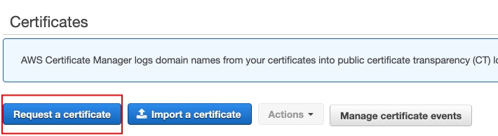
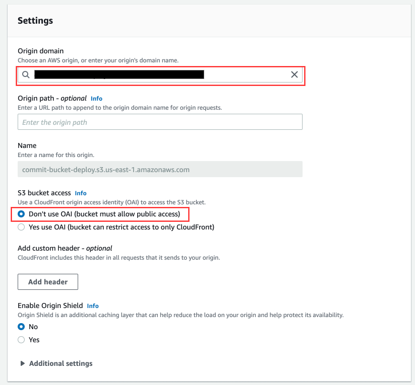
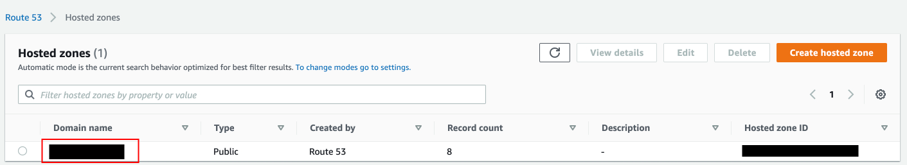

# Set Up Infrastructure

- In this directory, you will find everything you need in order to set up the infrastructure.
- For the moment, I opted for a step-by-step walkthrough explaining how to do it via the 
  AWS's Management console.
- I also provided a simplified version of the CDK code I am using.
  > You will certainly want to modify this code for your specific needs before including it into
  > your project. This code might not respect your coding standards neither since I had to inline
  > different utility functions I use in my own project.
- For more details, you can also have a look at the following articles:
  - Python CDK example: [Multiple static web in the same S3 Bucket (with CDK)](https://rubenjgarcia.cloud/multiple-static-web-same-s3-bucket/)
  - Step-by-step walkthrough: [How to Host Multiple React Apps in the Same AWS S3 Bucket](https://karen-kua.medium.com/how-to-host-multiple-react-apps-in-the-same-aws-s3-bucket-cloudfront-c518c2b38408)

## Walkthrough

### Create wildcard certificate

1. Navigate to Certificate Manager 
1. Click on Request a certificate
   
1. Request a public certificate
   
1. Enter your wildcard domain name
   
   > We strongly recommend using a subdomain to group all websites and
   > avoid any conflict with other deployed resources
1. Choose a validation method
   
1. Add tags if needed
   
1. Review and confirm
   

### Create S3 bucket

1. Navigate to S3
1. Click on Create bucket
   
1. Enter a bucket name
   
1. Enable public access to the bucket
   
1. Leave all other settings as default and confirm
1. Once created, navigate to the bucket properties
1. Scroll down to Static website hosting section
   
1. Enable static website hosting
   
1. Copy bucket website url
   > You will need it in the next section
1. In the Permissions tab, edit the bucket policy as follows:
   > Make sure to modify templated values
   ```json
   {
       "Version": "2012-10-17",
       "Statement": [
           {
               "Effect": "Allow",
               "Principal": {
                   "AWS": "*"
               },
               "Action": "s3:GetObject",
               "Resource": "arn:aws:s3:::<bucket-name>/*",
               "Condition": {
                   "StringLike": {
                       "aws:Referer": [
                           "http://<wildcard-domain-name>/*",
                           "https://<wildcard-domain-name>/*"
                       ]
                   }
               }
           }
       ]
   }
   ```

### Create routing lambda

1. Navigate to Lambda
1. Click on Create function
   
1. Create your lambda from cloudfront-http-redirect blueprint
   
1. Enter lambda name, role name, and add Basic Lambda@Edge permissions using policy templates
   
1. Leave all other settings as default and confirm
   
1. Once created, modify the code using this [gist](https://gist.github.com/SamuelCabralCruz/2a1a44ccc3a43b64024bd1da364c99bc) 
   
   > Don't forget to update the code with your wildcard domain name and your bucket's website url
1. Then Deploy your lambda by clicking on the Deploy button
1. Publish a version of the lambda
   
   
1. Copy the function ARN in the overview
   > You will need it in the next section

### Create cloudfront distribution

1. Navigate to CloudFront
1. Click on Create distribution
   
1. Configure s3 bucket created earlier as the origin
   
1. Configure the default cache behavior to redirect http to https and include
   host header and all query strings
   
   
1. Associate the routing lambda to be executed on every request
   
1. Modify payment settings to minimize costs and enter the wildcard domain name as an alternative CNAME
   
1. Select the wildcard certificate created earlier and select the TLSv1.2_2021 security policy
   
1. Confirm distribution creation

### Create dns record

1. Navigate to Route53
1. Go to your hosted zones
   
1. Select the desired hosted zone
   
1. Click on Create record
   
1. Create a record with your wildcard domain name which will alias to the cloudfront distribution we just created
   

### Take a coffee

- That's it you are done!
- It may take sometime for the dns record to take effect.
- To make sure everything works as expected
   - You can go ahead and create a folder called website1 into your s3 bucket
   - Upload a simple index.html file with the following content
     ```html
     <html>
       <body>
         <h1>Website 1</h1>            
       </body>
     </html>
     ```
     - [File to upload](./index.html)
   - Then open another tab into your browser and navigate to the following url
      `https://website1.<subdomain>.<domain>`
   - Expected result
     
